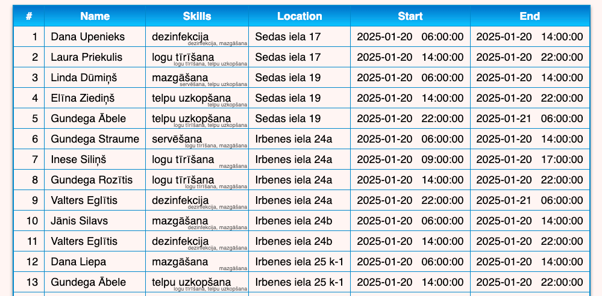

# Cleaners Workschedule Optimizer

Made using Python (optapy) and Java.

Runs from Docker on top of Python 3.10 Alpine image.

## Usage

1. Clone the repo.
2. Go to the cloned directory using a termainal.
3. Run `./rebuild.sh`. The program will be build and exectued.
4. (To rerun the program without rebuilding it, run `./exec.sh`.)
5. Go to http://localhost:8080/ for the frontend.

Riga.

January, 2025

By Arturs Jefimovs

Latvian State University
